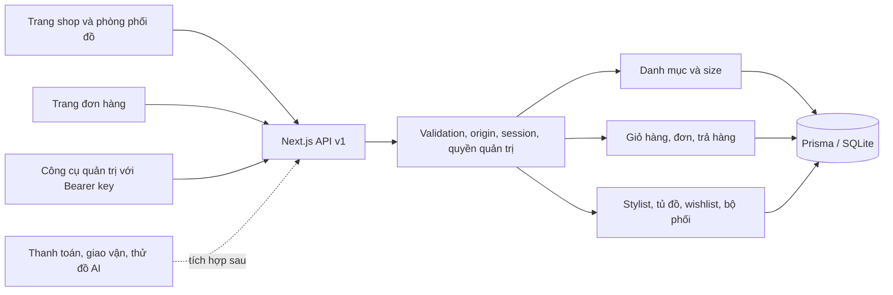
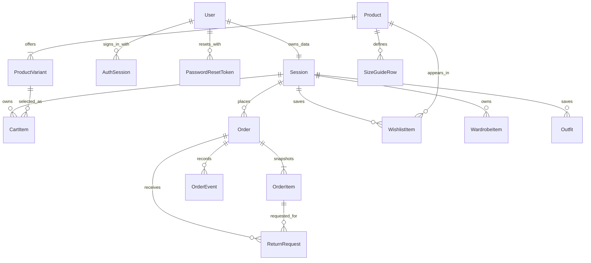
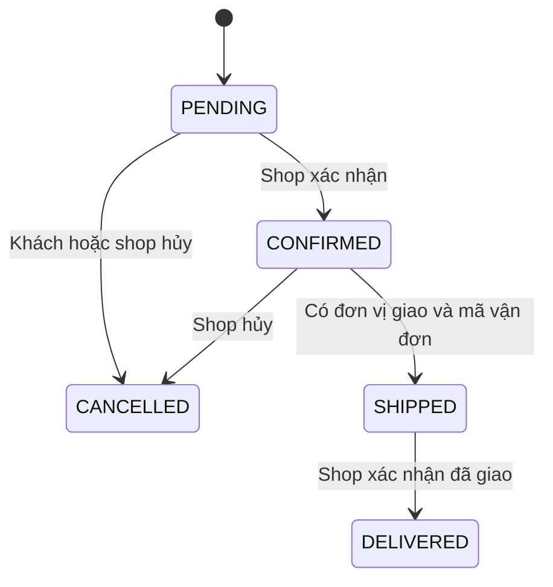

# Thiết kế backend và dịch vụ thời trang FitCraft

Ngày khảo sát: 21/09/2026.

## Cơ sở thiết kế

FitCraft đã có giao diện danh mục, phòng phối đồ, chat và tủ đồ minh họa trên Next.js. Trước thay đổi, giỏ hàng và sản phẩm chỉ nằm trong React state; API stylist trả bộ đồ cố định; API thử đồ trả mã job nhưng không có xử lý hay endpoint lấy kết quả.

Các quan sát dưới đây đến từ tính năng công khai. Kiến trúc đề xuất là thiết kế riêng cho FitCraft, không phải khẳng định về backend nội bộ của các thương hiệu.

| Nguồn tham khảo | Quan sát công khai | Áp dụng cho FitCraft |
| --- | --- | --- |
| [Zara — mua hàng trực tuyến](https://www.zara.com/vn/vi/help-center/OnlinePurchases) | Có mua hàng bằng tài khoản hoặc khách vãng lai | Bắt đầu bằng phiên khách an toàn, thêm tài khoản và hợp nhất giỏ sau |
| [Zara — hoàn trả hàng](https://www.zara.com/vn/vi/help-center/HowToReturn) | Có quy trình hoàn trả riêng | Tách yêu cầu trả hàng, xét duyệt và tiếp nhận khỏi trạng thái đơn |
| [H&M — hướng dẫn size](https://www2.hm.com/en_us/customer-service/sizeguide.html), [giải thích size và số đo](https://www.hm.com/is/customer-service/products-quality/quality/) | Bảng số đo cơ thể và số đo sản phẩm có ý nghĩa khác nhau | Bảng size gắn với sản phẩm, đơn vị cm; không suy ra độ vừa tuyệt đối từ chiều cao/cân nặng |
| [UNIQLO — lên lai quần online](https://www.uniqlo.com/vn/vi/special-feature/alteration-service) | Có tùy chọn dịch vụ chỉnh chiều dài quần và điều kiện riêng | Thiết kế dịch vụ sửa đồ theo dòng đơn hàng ở giai đoạn mở rộng |
| [UNIQLO — Click & Collect](https://www.uniqlo.com/vn/vi/special-feature/cp/click-and-collect) | Đặt online, nhận tại cửa hàng | Dự kiến mô hình kho/cửa hàng, tồn theo địa điểm, lựa chọn nơi nhận |

Không sao chép hình ảnh, dữ liệu khách hàng hoặc quy định kinh doanh của những website này. Ảnh hiện dùng lại nguồn minh họa Unsplash của giao diện, cần thay bằng ảnh sản phẩm của shop.

## Kiến trúc được triển khai

Dùng một ứng dụng Next.js, chia module nghiệp vụ bên trong. Phù hợp với quy mô hiện tại, triển khai đơn giản và giữ được giao dịch nguyên tử giữa giỏ hàng, tồn kho và đơn hàng.

- `lib/server/http.ts`: session, bảo vệ origin, quyền quản trị, giới hạn body 64 KB, định dạng lỗi.
- `lib/server/catalog.ts`: đọc/tạo sản phẩm và bộ lọc.
- `lib/server/commerce.ts`: chính sách, giao dịch tồn kho, checkout, trạng thái đơn và trả hàng.
- `lib/server/fashion.ts`: phối đồ theo danh mục, ngân sách và bảng số đo.
- `app/api/v1/[...path]/route.ts`: định tuyến REST, không chứa thông tin khóa ở client.
- `prisma/schema.prisma` và `prisma/migrations`: mô hình và lịch sử tạo database.

## Mô hình dữ liệu

SKU là đơn vị tồn kho: cùng sản phẩm nhưng khác size hoặc màu là SKU khác nhau. Giá dùng số nguyên VND. Dòng đơn hàng chụp lại tên, SKU, size, màu, ảnh và đơn giá tại thời điểm đặt; sửa sản phẩm không làm thay đổi lịch sử đơn.

`Outfit.productIds` hiện là JSON chuỗi chứa danh sách ID, được kiểm tra trước khi lưu; đây là lựa chọn MVP. Khi có chỉnh sửa bộ phối, phiên bản hoặc phân tích thống kê, chuyển sang bảng nối OutfitItem.

## Luồng mua hàng và tính nhất quán

1. Server cấp cookie ngẫu nhiên 256 bit; database chỉ lưu SHA-256 của token. Cookie HttpOnly, SameSite=Lax và Secure khi production.
2. Thêm giỏ bằng variantId và quantity, không nhận đơn giá từ trình duyệt. Giỏ không giữ chỗ tồn kho.
3. Checkout bắt buộc `Idempotency-Key`. Cùng phiên + cùng khóa + cùng thông tin nhận hàng trả lại đơn cũ. Cùng khóa nhưng khác thông tin trả 409.
4. Trong một giao dịch: kiểm tra sản phẩm đang bán, trừ tồn với điều kiện đủ hàng, tính tổng, tạo đơn/dòng đơn/sự kiện và xóa giỏ. Một SKU lỗi thì rollback toàn bộ.
5. Hủy đơn hợp lệ hoàn kho trong cùng giao dịch, chỉ một lần.
6. Thử lại xung đột database có giới hạn; không tự tạo đơn khác khi người dùng gửi lại yêu cầu.

Khóa idempotency nhận diện **một lần đặt hàng**, không được tái sử dụng cho một giỏ mới. UI giữ khóa khi thử lại trong cùng biểu mẫu; nếu mất kết nối rồi tải lại trang, nên kiểm tra trang đơn hàng trước khi đặt lại.

Trả hàng: REQUESTED → APPROVED / REJECTED; APPROVED → RECEIVED. Chỉ nhận yêu cầu cho đơn đã giao trong thời hạn cấu hình, số lượng cộng dồn không vượt đã mua. RECEIVED chưa có nghĩa đã hoàn tiền. Hàng trả cần kiểm định trước khi nhập lại kho; không tự tăng tồn hay ghi nhận hoàn tiền.

`paymentStatus` chưa có luồng đối soát tiền; giao hàng không tự đánh dấu PAID. Shop cần đối soát COD với bên giao hàng. Tích hợp thanh toán sau này phải có ledger và webhook xác thực riêng.

## Phạm vi dịch vụ hiện tại

| Dịch vụ | Hiện trạng |
| --- | --- |
| Sản phẩm/SKU, tồn kho, chất liệu, chăm sóc | API và danh mục UI |
| Giỏ hàng, checkout COD, theo dõi/hủy đơn | API và UI |
| Trả hàng | UI gửi yêu cầu; API quản trị xử lý |
| Stylist | Chọn áo + quần/váy và phụ kiện tùy ngân sách; còn hàng; không dùng LLM |
| Bảng size | API tư vấn theo số đo; dữ liệu seed minh họa |
| Bộ phối đã lưu | API và nút lưu trong phòng phối đồ |
| Wishlist, tủ đồ | Tủ sản phẩm theo tài khoản có nút trái tim, filters/sort và gợi ý phối đồ rule-based; xem personal-wardrobe.md. Tủ thủ công cũ được giữ riêng. |
| Thử đồ AI | Chưa có provider; API trả 503, UI chỉ xem ảnh gốc |
| Quản trị | API dùng khóa bí mật; chưa có dashboard |
| Thanh toán online, vận chuyển tự động, email/SMS | Chưa kết nối |

Các giả định kinh doanh đang dùng: COD; phí giao 30.000 VND, miễn phí từ 1.000.000 VND; cửa sổ trả hàng 14 ngày từ lúc giao. Đây là ví dụ riêng của FitCraft, không phải chính sách được người dùng phê duyệt hay sao chép từ thương hiệu tham khảo.

Phiên khách hết hạn sau 30 ngày; xóa cookie hoặc đổi máy sẽ không truy cập được đơn cũ. Database vẫn giữ đơn để shop xử lý. Trước mở bán cần tài khoản/OTP hoặc đường dẫn truy cập đơn có chữ ký, và cơ chế xác minh quyền sở hữu khi hỗ trợ khách.

## Thiết kế mở rộng

| Ưu tiên | Module | Dữ liệu và tích hợp cần có |
| --- | --- | --- |
| Trước mở bán | Hoàn thiện quản trị | Address, AuditLog; phân quyền chi tiết hơn ADMIN/CUSTOMER và nhật ký thao tác |
| Trước mở bán | Thanh toán/giao vận | PaymentAttempt, PaymentEvent, Refund, Shipment; webhook có chữ ký và ID sự kiện duy nhất; giá trị/orderId kiểm tra ở server |
| Trước mở bán | Chống lạm dụng, vận hành | Rate limit ở gateway hoặc Redis; log có correlation ID, che dữ liệu cá nhân; metrics và cảnh báo |
| Tiếp theo | Ảnh riêng tư và thử đồ | Upload được ký tới object storage, xác minh loại/kích thước file, worker hàng đợi, TryOnJob, thời hạn lưu/xóa ảnh, sự đồng ý của khách |
| Tiếp theo | Tư vấn chuyên sâu | Profile số đo tự nguyện, size theo thương hiệu, feedback độ vừa, outfit theo dịp/thời tiết; LLM chỉ chọn ID sản phẩm có thật và kiểm tra ngân sách sau sinh |
| Tiếp theo | Nhận tại cửa hàng | Location, InventoryBalance, StockReservation, PickupWindow; tồn theo nơi nhận và hết hạn giữ chỗ |
| Tiếp theo | Sửa/lên lai quần | AlterationService, OrderItemService, thông số cm, phí, thời gian xử lý, xác nhận điều kiện trả hàng |
| Sau khi có dữ liệu | Đánh giá, khách thân thiết | Review gắn sản phẩm đã mua, kiểm duyệt, LoyaltyLedger, coupon có giới hạn và tính nguyên tử khi sử dụng |
| Sau khi có dữ liệu | Gợi ý và bổ sung hàng | Wishlist/back-in-stock subscription có consent; lịch sử tương tác; theo dõi hiệu quả gợi ý |

Không tự động gửi ảnh hay thông tin khách cho bên thứ ba. Cần chọn provider, credentials và hợp đồng API trước khi viết adapter. API job chỉ trả 202 khi job đã được lưu và có worker thực sự nhận xử lý; phải có GET trạng thái theo chủ sở hữu và trạng thái thất bại có thể điều tra.

## Từ SQLite sang môi trường triển khai

SQLite hiện phù hợp một máy chủ có ổ đĩa bền vững. Không dùng file SQLite này trên nhiều instance/serverless hoặc ổ đĩa tạm.

Khi chuyển PostgreSQL: đổi datasource, tạo bộ migration riêng cho PostgreSQL, chuyển dữ liệu có kiểm tra số dòng/tổng tiền/tồn kho, chạy lại các kiểm thử cạnh tranh với database mới. Migration SQL SQLite hiện tại không thể dùng nguyên xi cho PostgreSQL. Dùng connection pool, sao lưu và diễn tập khôi phục trước vận hành.

Các bước còn cần trước mở bán: thay dữ liệu seed và chính sách mẫu; kiểm tra dependency audit và cập nhật phiên bản được hỗ trợ; hoàn thiện xác thực/rate limit/dashboard; kiểm tra trên trình duyệt/thiết bị thật; quyết định lưu/xóa dữ liệu cá nhân; kiểm tra dịch vụ thanh toán/giao vận trong sandbox của provider.

## Kiểm chứng

- TypeScript và Next.js production build.
- 17 bài kiểm thử tích hợp trên SQLite riêng: lọc danh mục, cart isolation, checkout/idempotency, cạnh tranh sản phẩm cuối, rollback, hủy/hoàn kho, trả hàng, tài khoản/khôi phục mật khẩu, dashboard/phân quyền quản trị, origin/body limit, stylist, size và dữ liệu cá nhân.
- HTTP smoke cho trang chủ, API sản phẩm và trang đơn hàng.

Kiểm thử trên SQLite không chứng minh hành vi concurrency của PostgreSQL hoặc dịch vụ bên ngoài. Chưa chạy kiểm thử trình duyệt tự động hay kết nối provider thực.

Trong lúc cài dependency, npm báo 5 cảnh báo bảo mật (4 high, 1 critical). Chưa thực hiện audit chi tiết hoặc nâng cấp major framework trong phạm vi này; cần xử lý các cảnh báo trước khi đưa bản này lên môi trường bán hàng công khai.
